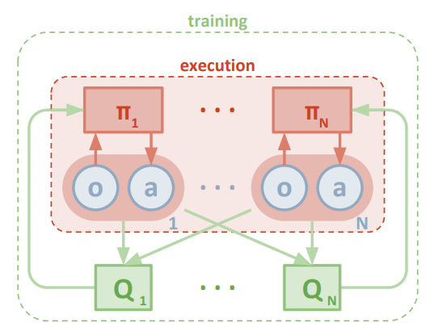
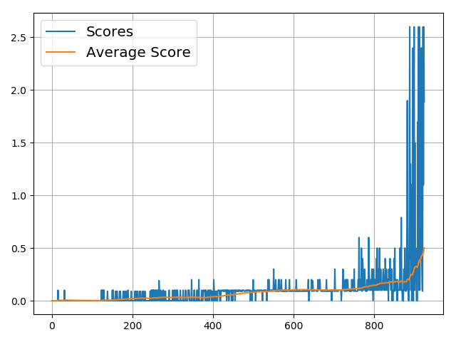

# Project report

## Learning algorithm

This project is based on the [Multi-Agent Actor-Critic for Mixed Cooperative-Competitive Environments](https://arxiv.org/abs/1706.02275) algorithm to solve an episodic task. The implementation is based on Multi Agent Deep Deterministic Policy Gradient.

[Deep Deterministic Policy Gradient (DDPG)](https://arxiv.org/abs/1509.02971) is an off policy actor critic algorithm, that uses the concept of target networks.

To solve the tennis environment, the agents have to work together: they've got to collaborate to achieve the goal, which is to keep the ball in play. Both agents have their own local observations, own policies and own actions. 

During training, 
- the _critic_ uses extra information: *all states observed and actions taken by all other agents.*
- each _actor_ has only access *to its agents own observation and actions.*

During execution, only the actors are present and only its own states and observations can be used.

This approach of decentralized actor and centralized critic has been adopted by this paper and is shown in this figure

 

## Parameters and hyperparameters

### Neural network architecture

The network consists of two networks: The actor network and the critic network.

#### Actor network

- *Input layer*: 33 input nodes: _size of state vector_
- *Hidden layer 1*: 128 nodes, ReLU activations
- *Hidden layer*: 64 nodes,ReLU activations
- *Output layer*: 4 output nodes: _size of action vector_, tanh activation

#### Critic network

- *Input layer*: 33+4 input nodes: _size of state and action vector per agent_
- *Hidden layer 1*: 256 nodes, ReLu activation
- *Hidden layer*: 64 nodes, ReLu activation
- *Output layer*: 1 _no activation_, Q Value. In DDPG the critic is used to approximate the maximizer of the Q values of the next state.

#### Hyperparamters

- n_episodes _Maximum number of episodes. Default: 20000_ 
- ou_noise _Starting noise of the Ornstein–Uhlenbeck process noise. Setting this to zero makes your agent unable to learn. Default: 2.0_
- ou_noise_decay_rate _Rate with which to decay the noise after each epoch. Default: 0.998_ 
- buffer_size _Size of the replaybuffer in samples. Default: 1000000_
- batch_size _size of batches to sample. Default: 512_
- update_every _after how many epochs to update the agents. Default: 2_ 
- tau _rate at which to softupdate the networks. Default: 0.01_
- lr_actor _Learning rate of the actor. Default: 0.001_
- lr_critic _Learning rate of the critic. Default: 0.001_

# Results

> Episode 100	Average: 0.002	Min:0.000	Max:0.100  
> ... 
> Episode 600	Average: 0.104	Max:0.300  
> Episode 900	Average: 0.283	Max:2.600  
> Episode 926	Average: 0.503	Max:2.600  

*Environment solved after 926 episodes!*

Here's a plot that shows the development of scores and moving average per episode.

## Next steps
To improve the agents performance
- train longer
- try different learning rates and...
- of course: implement a scaled up version of PPO and play Starcraft!